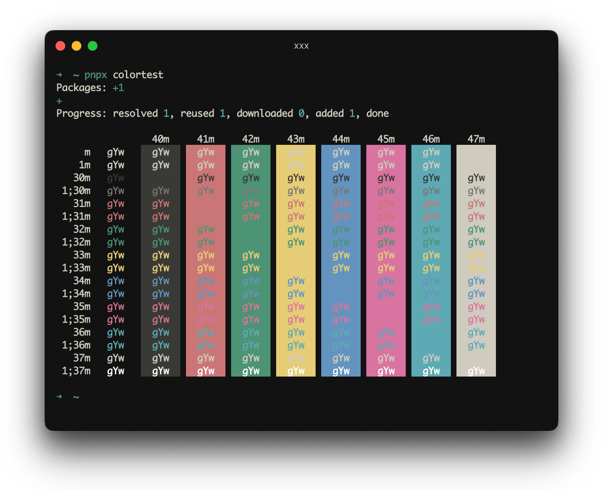
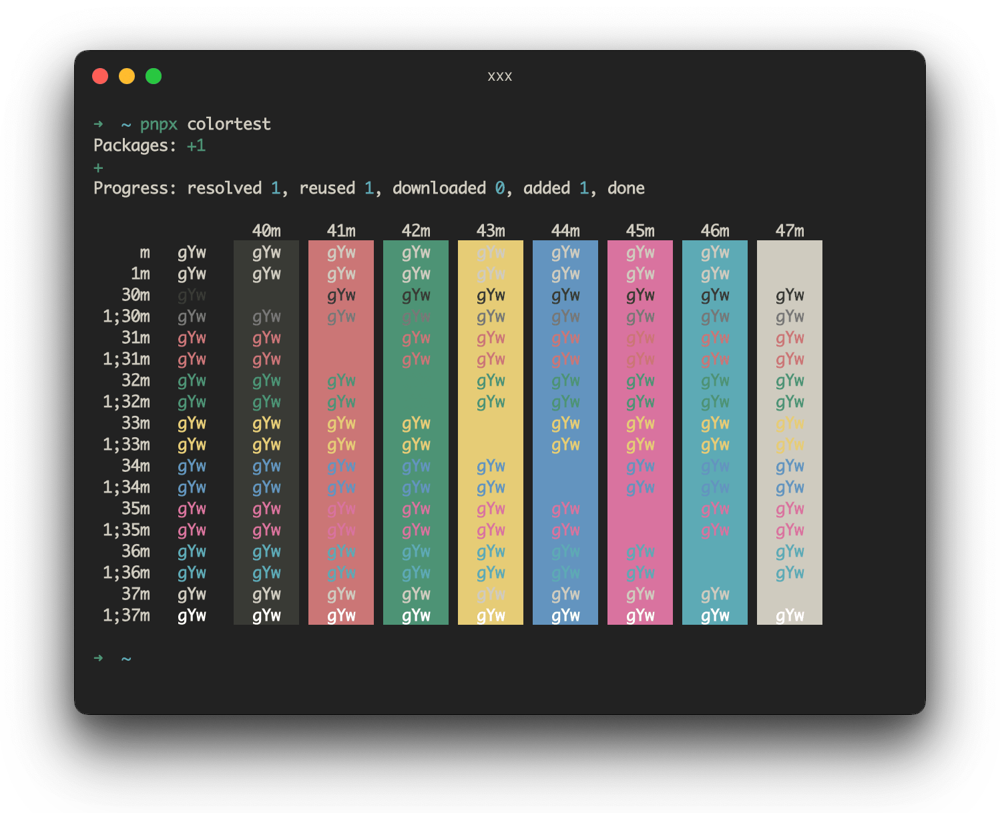
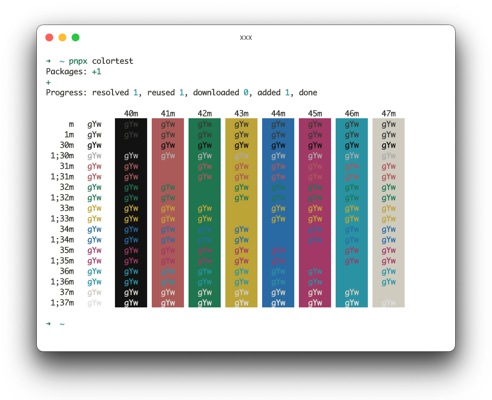
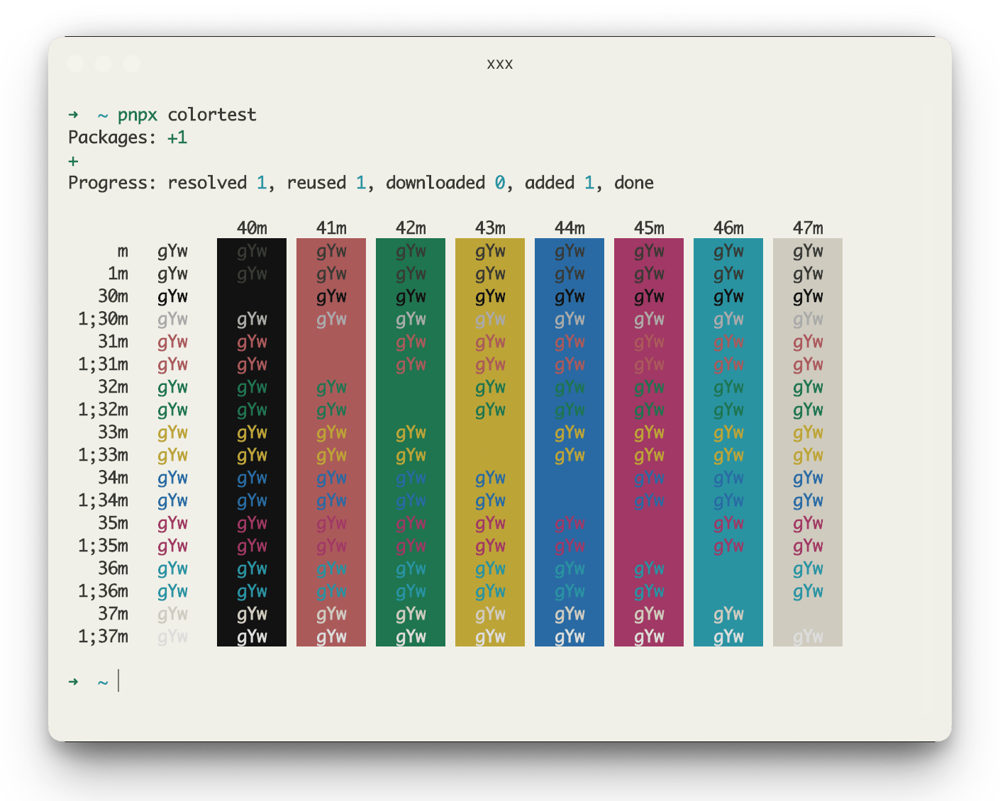

<p align="center">
  
    <h2 align="center">Vitesse Theme for Hyper Terminal</h2>
</p>

## Usage

```sh
hyper i hyper-vitesse
```

or

```javascript
// Hyper config, e.g. ~/.hyper.js
plugins: ["hyper-vitesse"],
```

## Options

```javascript
config: {
	theme: {
    // [usage] 'vitesse-dark' | 'vitesse-dark-soft' | 'vitesse-light' | 'vitesse-light-soft'
    // [default] variant vitesse-dark
	  variant: 'vitesse-dark',

		// [optionally] override Vitesse palette per variant
		'vitesse-dark': {},
		'vitesse-dark-soft': {},
		'vitesse-light': {},
		'vitesse-light-soft': {}
	}
}
```

## Gallery

**Dark**



**Dark Soft**



**Light**



**Light Soft**



## Thanks

The color scheme of this project is based on [vscode-theme-vitesse](https://github.com/antfu/vscode-theme-vitesse). This is an interesting guy（ [
Anthony Fu](https://github.com/antfu)）.